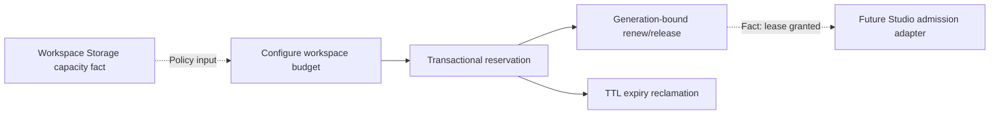

# Resource Budget and Lease Design

## Observable result

Two local processes competing for one workspace cannot reserve more configured bytes or execution slots than the budget permits. An accepted reservation has a durable generation and expiry, can be renewed or released idempotently, and stops consuming capacity after expiry.

## Owner and boundaries

`Resource Budget` is the only writer of budget configuration and reservation leases. Workspace Storage owns filesystem namespaces, actual-byte measurement and quota projection. Video Graph Studio owns workflow lifecycle and may retain only reservation ID/generation. Workspace Access owns caller authorization. Resource Budget does not inspect files, run workflows, authenticate clients or bill users.

## Public contract

- `configure --workspace-id --byte-limit --execution-slots`
- `reserve --workspace-id --reservation-id --bytes --slots --ttl-seconds`
- `renew --workspace-id --reservation-id --expected-generation --ttl-seconds`
- `release --workspace-id --reservation-id --expected-generation`
- `snapshot --workspace-id`
- `doctor`

All mutations use SQLite `BEGIN IMMEDIATE`. A reservation ID is a stable operation identity. Same active ID and canonical request replays; changed input conflicts. Renew increments generation. Release requires the current generation and repeats safely. Expired leases are reclaimed transactionally before every capacity decision.

## State owner and invariant matrix

| State | Owner | Protected invariant |
| --- | --- | --- |
| Workspace byte/slot limit | Resource Budget | one current configuration per workspace |
| Active reservation and generation | Resource Budget | summed active reservations never exceed configured limits |
| Files and actual disk usage | Workspace Storage | Resource Budget never infers filesystem truth |
| Workflow run/checkpoint | Video Graph Studio | lease status cannot declare workflow completion |
| Caller scopes | Workspace Access | a lease does not authenticate a caller |

## Capability DAG

Hard dependencies are SQLite durability, bounded identifiers and UTC expiry. Workspace Storage capacity is an adjacent policy input, not imported state. Studio composition is dependent and remains unimplemented in the independent proof.

## Failure and cleanup behavior

- Duplicate reserve: prior active result, no additional capacity.
- Conflict: same reservation ID with changed resources/TTL is rejected.
- Budget exhausted: rejected without mutation.
- Stale renew/release generation: rejected without mutation.
- Released reentry: duplicate release; reservation ID cannot be reused.
- Expired lease: reclaimed inside the next transaction.
- Process interruption: SQLite transaction rollback preserves the last committed state.

## Decision gates and non-goals

Budget tier pricing, GPU/network units, hosted database, tenant identity, reservation preemption and billing are unapproved. This slice does not enforce external filesystem writers, prove distributed consensus or claim production isolation.
