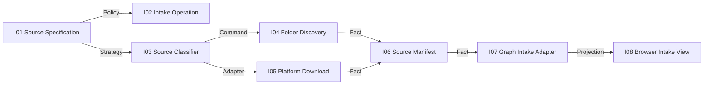

# Source Intake Graph Design

**Status:** Accepted under the user's standing instruction to continue autonomously without repeated approval gates.

## Observable result

A creator supplies either a local folder or one supported social-video URL. One independently runnable program produces a versioned `source-manifest.json` containing inspectable local media references and an operation receipt. Video Graph Studio can invoke the same program as a graph node and display its committed result.

## Selected architecture

Create `apps/source-intake` as a new independent MVP. Folder discovery is owned locally by Source Intake. URL download remains owned by `platform-io`; Source Intake invokes its public PowerShell launcher and consumes `download-receipt.json`. The Graph Studio process manager owns only the checkpoint that says the Intake child committed.

This is preferable to adding download code inside Graph Studio because CLI, future hosted Workers and a mobile client can reuse Source Intake without running the current website. It is preferable to making one universal media service because folder inventory and platform transport retain distinct evidence boundaries.

## State owners

| Mutable state | Unique owner | Invariant | Mutation | Fact/query |
| --- | --- | --- | --- | --- |
| Canonical intake operation and fingerprint | Source Intake Operation Owner | same ID and input replay; changed input conflicts | `CMD-INTAKE-CREATE` | `IntakeCompleted` receipt |
| Standard local media inventory | Source Manifest Owner | every published entry exists, is supported media and is inside the admitted root | publish manifest | `QRY-INTAKE-GET-MANIFEST` |
| Download attempt and platform receipt | existing Platform I/O | detected platform matches URL; output is probed; secret values redacted | public download launcher | `download-receipt.json` |
| Graph continuation | Workflow Process Manager | stable child ID; resume first missing checkpoint | execute node | committed step result |
| Browser intake state | Dashboard Projection | read-only projection of committed facts | none | HTTP query |

## Public Source Intake CLI

```text
source-intake folder <folder> --output-dir <dir> --operation-id <id>
source-intake url <url> --output-dir <dir> --operation-id <id> [--cookies <file>] [--max-height 1080]
```

Both modes write:

- `source-manifest.json`: schema version, source kind, source fingerprint and media entries;
- `intake-receipt.json`: operation identity, canonical input fingerprint, result class, manifest hash and platform receipt reference when applicable.

The receipt never contains cookie paths, cookie contents, tokens or browser profiles. Cookie file content contributes only an irreversible SHA-256 value to the private canonical input fingerprint used for conflict fencing.

## Source manifest contract

```json
{
  "schemaVersion": 1,
  "sourceKind": "folder",
  "source": {"root": "C:/media"},
  "media": [
    {"id": "sha256(path,size,mtime)", "path": "C:/media/a.mp4", "size": 123, "extension": ".mp4"}
  ]
}
```

URL mode records the public URL, detected platform and platform receipt path. It never records credentials. Media entries are sorted by normalized path for deterministic manifests.

## Capability DAG



Build order is I01/I03, I02, I04/I06, I05, I07, then I08. The lowest unproven node is I01 Source Specification.

## Failure and recovery

- Unsupported URL hosts fail before a process starts.
- An empty folder returns a terminal rejected receipt and publishes no manifest.
- Platform failure preserves its redacted receipt and Source Intake returns failed without publishing a successful manifest.
- Same operation and fingerprint returns the original successful receipt if referenced media still exists.
- Same operation with changed input is a conflict and does not overwrite artifacts.
- Temporary files publish through atomic replacement.
- Graph retry reuses `<run-id>:step:intake`; it never creates a second logical download.

## Browser behavior

The Source control becomes `Folder | URL`. URL mode accepts only supported HTTPS hosts and changes the first graph nodes to `Social URL -> Download 1080p -> Verify source`. Folder mode displays `Local folder -> Discover media -> Verify source`. Platform cookies remain an optional local file reference in a later credential UI; anonymous download is the default.

## Evidence and completion boundary

Focused tests prove classification, deterministic inventory, idempotent replay, conflict, empty input and redaction. Adjacent integration uses a real `platform-io` receipt through a deterministic fake process adapter, then a real anonymous download of one stable public test URL when the external platform is available. Domain tests can support `DOMAIN_VERIFIED`; a successful real download supports `PLATFORM_INTEGRATED` for that platform only, not all four and not upload.

## Non-goals

- No transcription, translation, dubbing or upload in this slice.
- No playlist/channel bulk download; the existing public platform contract is single-video.
- No Cookie contents stored by Source Intake or Graph Studio.
- No parallel downloads.
- No claim that one platform smoke proves the other three.

