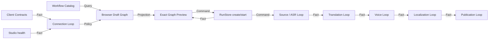

# Studio Guided Graph UI Design

## Problem

Video Graph Studio currently presents a fixed workflow runner as if it were a free-form ComfyUI editor. The capability palette ends every row with `+`, the canvas exposes connection ports, and the toolbar exposes select and zoom controls, but those controls do not insert, connect, move, or zoom anything. Selecting a palette row only changes the Inspector. The canvas always renders three summary cards even when the admitted Graph contains 4, 6, 8, 10, or 12 executable nodes. Nineteen template radios expose implementation names instead of helping a creator choose an outcome.

The failure is observable in the live page:

- clicking **Zoom in** leaves the label at `100%`;
- clicking the `URL intake +` palette row leaves the graph at three nodes and only changes Inspector focus;
- `URL+Dub` reports `0 / 10` while showing three cards;
- the active server returns `404` for `/api/v1/contracts`, so the primary action is disabled under a non-actionable `Contract unavailable` badge.

## Observable result

A creator can open Studio, choose one outcome, choose a source, see the exact sequential Graph and its internal Loops, understand every missing requirement, and create/start the Graph from one truthful primary action. Every visible control performs the action its label and shape promise.

## Approaches considered

### Full free-form node editor

This would add arbitrary node insertion, edge editing, graph validation, graph persistence, version migration, and safe execution of user-authored graphs. It is the closest visual copy of ComfyUI but it introduces an unapproved execution-authority surface and is far larger than the current fixed-template backend.

### Wizard only

This is simplest for beginners but hides Graph Engineering and makes it difficult to understand where a long batch is currently running or which owner can resume it.

### Guided Graph Builder — selected

Studio keeps approved workflow templates but presents them as outcomes rather than implementation IDs. Configuration and readiness form a guided left rail. The canvas renders the real template nodes and typed edges. Loop boundaries are explicit. Users can inspect nodes and fit or zoom the graph, but cannot insert or connect nodes until an independently designed editable-graph capability exists.

## State-owner and invariant matrix

| State | Unique owner | Protected invariant | Public mutation | Public read/fact |
| --- | --- | --- | --- | --- |
| approved workflow definitions | Video Graph Studio Workflow Catalog | every preview node and edge corresponds to an admissible template revision | repository release | `GET /api/v1/capabilities` projection |
| unsaved workflow choice and form values | browser Draft Graph | changing a draft never creates a Run or contacts a platform | local form actions | readiness projection |
| service and contract readiness | browser Connection Loop | mutation remains disabled until current contracts and health are proven | reconnect command | explicit readiness checks and error detail |
| durable run and node statuses | RunStore | one immutable Graph per operation; statuses come only from committed run facts | versioned create/start/cancel commands | run and queue projections |
| business continuation checkpoints | existing child MVP owners | Studio never edits child continuation state | child public commands | child receipts and manifests |

## Use cases and typed relationships

1. `Query` the Workflow Catalog and group workflows by creator outcome.
2. `Command` the browser Draft Graph to select an outcome, source kind, and options without creating durable state.
3. `Projection` turns the selected workflow definition into exact nodes, typed edges, Loop labels, and missing-input checks.
4. `Policy` permits **Create & run Graph** only when contract, health, access, source, and workflow-specific configuration checks pass.
5. `Command` creates and starts one durable Graph using the existing versioned contracts.
6. `Fact` projections update the same exact nodes from RunStore status and logs.

## Capability DAG

The lowest unproven node is the Workflow Catalog projection. It replaces duplicated, drifting client copy with a read-only projection of the Graph definitions the API can actually admit.

## Interaction design

### Left rail: Build a Graph

- A large **New Graph** heading explains that a Graph is one durable job made of sequential Loops.
- Outcome cards are grouped as **Prepare**, **Create**, **Batch**, **Publish**, and **Account**.
- Folder and URL variants appear under one outcome as a source-kind choice where both exist.
- Selecting an outcome reveals only its required fields.
- A readiness checklist names every blocker. Contract failure includes the server response and a **Reconnect** action.
- The primary button reads **Create & run Graph**. Its adjacent summary explains platform contact risk (`Local only`, `Planning only`, or `Contacts YouTube privately`).

### Center: truthful execution map

- The canvas renders every node from the selected Workflow Catalog Graph, not three synthetic cards.
- Nodes are grouped into labelled Loop lanes: Source, Transcription, Translation, Voice, Localization, Batch, Publication, Account, or Verification.
- Command/Adapter nodes and verification Policy nodes have different styling.
- Typed edges are rendered between exact nodes.
- Clicking a node selects it and updates the Inspector. There are no `+` signs or connection ports because insertion and edge editing are not supported.
- Fit, zoom out, and zoom in remain only after they have real behavior. The select-arrow control is removed.

### Right rail: plain-language Inspector

- Shows step number, owner, relationship, Loop, retry model, inputs, output fact, and current status.
- Uses creator language first and technical contract names second.
- Queue and recent runs remain read-only projections.

## Error handling

- Contract and health loading are separate checks, so a healthy-but-incompatible server is reported as **Server version mismatch**, not generic offline.
- A reconnect action re-runs contracts, health, catalog, and queue queries without reloading form input.
- Missing source or options appear as persistent checklist items rather than transient toasts.
- API admission failures preserve the draft and show the returned result class/detail next to the primary action.
- Platform-contact workflows display their effect before they can run; existing exact-SHA confirmation remains mandatory.

## Files and boundaries

- `studio/workflow_catalog.py`: immutable workflow metadata projected from existing `GraphDefinition` values; owns no run state.
- `studio/api.py`: exposes the catalog through existing `GET /api/v1/capabilities`.
- `web/workflow-model.mjs`: pure browser draft/readiness/graph projection functions.
- `web/app.js`: transport and DOM composition only; consumes the catalog and model.
- `web/index.html` and `web/styles.css`: guided builder, dynamic graph surface, readiness and responsive layout.
- `tests/video_graph_studio/test_workflow_catalog.py`: catalog-to-real-Graph contract tests.
- `tests/video_graph_studio/workflow_model.test.mjs` plus a pytest launcher: real pure-model behavior under Node.
- `tests/video_graph_studio/test_web_shell.py`: only static shell and accessibility boundaries not expressible through the pure model.

## Verification

1. RED catalog test proves every workflow projection is missing before implementation.
2. RED model tests prove grouped selection, source-variant resolution, readiness blockers, and exact node status projection are missing.
3. Focused Python and Node tests prove the catalog and Draft Graph independently.
4. Adjacent API tests compare every catalog graph fingerprint/node order with the actual admitted graph definitions.
5. Browser drill at 1280 x 720 exercises outcome selection, source entry, reconnect, real zoom, node inspection, and a safe local create/start path.
6. Full repository tests and manifest validation guard adjacent MVPs.

## Decision gates and non-goals

- Arbitrary node insertion, connection editing, drag persistence, custom graph execution, marketplace nodes, hosted collaboration, mobile layout, real authenticated upload, and public publication are not part of this slice.
- A later editable-graph MVP must define its own schema, authority, validation, versioning, and recovery evidence before any insertion or port UI returns.
- The catalog is a read-only Projection. It never becomes the Run or child-continuation owner.
