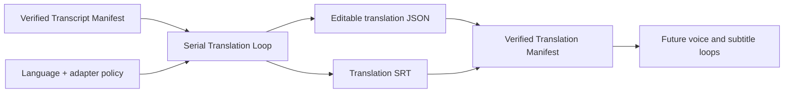

# Transcript Translation Loop Design

## Observable result

Given one committed Transcription manifest and one or more target languages, Translation processes every `(target language, media item)` in a deterministic serial order and publishes one editable translation JSON/SRT pair per item, one `translation-manifest.json`, and one `translation-receipt.json`.

## Ownership

Translation owns translated text, translation checkpoints, review state and the translation manifest. It reads but never edits transcript artifacts. Transcription owns timing and source text. Graph Studio owns workflow continuation only. Voice generation, subtitle styling, video rendering and publication remain separate capabilities.

## Capability DAG

## Contracts

- Input: Transcription `transcript-manifest.json` schema v1 plus exact SHA-256.
- Command identity: `operationId`, transcript-manifest SHA-256, ordered unique target languages and adapter identity.
- Work identity: target language plus stable source media ID.
- Translation document: schema v1, transcript fingerprint, source/target languages, preserved segment IDs/timing/source text and editable translated text.
- Review state: machine output starts as `MACHINE`; a future review command may republish it as `REVIEWED` without changing another owner's artifact.
- Translation manifest: exact transcript coverage for every requested language and verified JSON/SRT fingerprints.
- Receipt: terminal class, input fingerprint, ordered item outcomes, manifest path/hash and bounded errors.

## Loop behavior

Target languages retain the command order and media retain transcript-manifest order. The loop runs exactly one adapter call at a time. Each completed item is atomically published and checkpointed. Same operation/input reuses verified completed items; changed input conflicts. Any item failure is explicit and prevents a complete manifest.

## Adapters

The port accepts any segment translator with a stable identity. The first production adapter is local Meta NLLB using the existing Hugging Face model cache, selectable device and batch size. Tests use a deterministic fake. The domain owner never imports old localization internals or depends on Qwen/cloud APIs.

## Language policy

Public language tags are BCP-47-like values (`ru-RU`, `en-US`, `kk-KZ`). The NLLB adapter maps detected/source policies to model codes (`zho_Hans`, `eng_Latn`, `rus_Cyrl`, `kaz_Cyrl`). Unsupported or ambiguous language codes fail before work begins instead of silently choosing a language.

## Evidence gates

- Domain: input validation, exact coverage, deterministic serial order, replay/conflict, item failure isolation, atomic JSON/SRT and public CLI.
- Adjacent: Graph Studio invokes only the public launcher and verifies the committed manifest.
- Platform: one real transcript is translated with the installed local NLLB runtime; model execution is not a claim of human-grade translation quality.

## Non-goals

Human copy editing, voice synthesis, voice cloning, subtitle burn-in, audio mixing, creator-profile discovery and platform upload are later independent capabilities.
