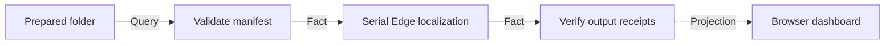

# Video Graph Studio Design

**Status:** Accepted by the user's standing instruction to make implementation decisions autonomously.

## Product result

A creator opens a local browser, chooses a prepared media folder, selects one or more target languages, a voice and target platforms, starts a graph run, and can see durable node-by-node progress until inspectable localized videos are produced. The first shipped slice runs Russian Edge-TTS localization against an existing localization batch manifest. Later slices add raw-folder intake, URL download and authenticated publication through replaceable adapters.

The product is local-first and binds to `127.0.0.1`. Its contracts must also support a future hosted control plane and mobile client without moving video-processing rules into the UI.

## Scope decomposition

This request contains several products. They are delivered as separate vertical slices in this order:

1. **Graph Control Plane:** durable graph definitions, runs, checkpoints, logs and a browser projection.
2. **Prepared Folder Localization:** compose an existing localization manifest with the Edge-TTS publisher.
3. **Raw Folder Intake:** discover videos, transcribe, translate and create localization jobs.
4. **URL Intake:** YouTube, Bilibili, Douyin and TikTok download adapters.
5. **Publishing:** platform-specific authenticated upload adapters and receipts.
6. **Commercial/Mobile Foundations:** accounts, remote workers, encrypted secrets and remote API authentication.

Only slices 1 and 2 belong to the first implementation plan. This prevents platform cookies, translation policy and commercial identity from becoming fake prerequisites for a working local product.

## Considered approaches

### Selected: local control plane with durable process owners

Python standard-library HTTP and SQLite adapters expose versioned JSON contracts. A graph process manager owns only run continuation. Existing MVPs remain separate programs invoked through adapters. A dependency-free HTML/CSS/JavaScript client renders the graph and read models.

Benefits: no new runtime dependency, portable on the current Windows setup, crash-resumable, easy to test, and replaceable HTTP/worker adapters for future mobile and hosted deployments. Cost: the first UI uses a purpose-built graph editor rather than a third-party canvas library.

### Rejected: one React application directly spawning tools

This provides rapid visual development but makes the browser or Node process own workflow state, mixes UI with process authority, and complicates restart recovery and mobile reuse.

### Rejected: adopt ComfyUI as the runtime

ComfyUI supplies a mature node canvas but its execution model and Python extension lifecycle would become a hard dependency. Video capabilities would be packaged as Comfy nodes instead of independent programs. We retain the useful graph interaction model without transferring authority to that framework.

## Architecture principles

The structure follows the referenced `roblox-city-scavenger` design chain:

```text
Creator result
  -> product rules
    -> independent capability MVPs
      -> owner and contract architecture
        -> engineering rules
          -> work plans, tests and evidence
```

Rules:

- Each mutable state has exactly one owner.
- Cross-owner continuation consumes committed facts, never another owner's private table.
- Every command has a stable `operationId`, `contractVersion`, input fingerprint and canonical result.
- A workflow run owns checkpoints and terminal outcome, not downloads, translations, voice clips, media files or publication accounts.
- Retry uses the same parent and child operation IDs and resumes the first missing checkpoint.
- The browser consumes projections and issues commands; it never edits authoritative rows.
- External processes are adapters behind public application commands.
- Runtime outputs and credentials are never committed to Git.

## State owners and invariants

| Mutable state | Unique owner | Protected invariant | Mutation contract | Read/fact contract |
| --- | --- | --- | --- | --- |
| Saved graph definition and revision | `GraphDefinitionOwner` | one immutable revision per canonical graph fingerprint | `CMD-GRAPH-SAVE-DEFINITION` | `QRY-GRAPH-GET-DEFINITION`, `GraphDefinitionSaved` |
| Run identity, fingerprint and lifecycle | `WorkflowRunOwner` | same operation and input replay; conflicting input rejected; one terminal result | `CMD-RUN-CREATE`, `CMD-RUN-CANCEL` | `QRY-RUN-GET`, `RunCreated`, `RunTerminal` |
| Step checkpoints and stable child IDs | `WorkflowProcessManager` | required order; committed steps never repeat; resume first missing step | `CMD-RUN-EXECUTE`, `CMD-RUN-RESUME` | `QRY-RUN-LIST-STEPS`, `StepCommitted` |
| Worker process handle | `LocalWorkerRuntime` | at most one process per running step; stop is idempotent | adapter start/stop | `WorkerExited` |
| Ordered run log | `RunLogOwner` | append-only per-run sequence | `CMD-LOG-APPEND` | `QRY-LOG-LIST`, `LogAppended` |
| Browser dashboard state | `DashboardProjection` | read-only, derived from committed run facts | none | `QRY-DASHBOARD-GET` |
| Localization media and receipts | existing `localization` MVP | output exists and receipt fingerprints match inputs | public launcher adapter | localized-video receipt |
| Download/upload receipts | existing `platform-io` MVP | platform operation is idempotent and verifiable | public launcher adapter | platform receipt |

## Contract envelope

Every state-changing HTTP command uses:

```json
{
  "contractId": "CMD-RUN-CREATE",
  "contractVersion": "1.0",
  "operationId": "client-generated UUID",
  "correlationId": "creator workflow UUID",
  "expectedVersion": 0,
  "payload": {}
}
```

Canonical results are `COMPLETED`, `DUPLICATE_COMPLETED`, `REJECTED_MALFORMED`, `REJECTED_VERSION`, `REJECTED_CONFLICT`, `REJECTED_NOT_FOUND`, `RETRYABLE_UNAVAILABLE`, and `FAILED`. A duplicate with the same fingerprint returns the original result. Reusing an operation ID with different canonical input returns `REJECTED_CONFLICT`.

## First graph template



The graph is a versioned execution plan, not free-form Python. Node types come from a capability catalog. Edges are validated as a DAG before a run is admitted. In the first slice the built-in template is editable only through its configuration fields; arbitrary node wiring becomes a later graph-authoring slice.

## Run lifecycle

```text
QUEUED -> RUNNING -> COMPLETED
                  -> FAILED
       -> CANCEL_REQUESTED -> CANCELLED
```

For each required node, the process manager records `PENDING`, `RUNNING`, then `COMPLETED` or `FAILED`. On restart, `RUNNING` steps become `INTERRUPTED`; resume reuses the same child operation identity and invokes the adapter's receipt-aware command. A completed replay does not spawn another process.

The initial scheduler runs one workflow at a time and one node at a time. This deliberately matches the user's instruction not to parallelize and protects the computer from runaway process creation.

## HTTP surface

| Method | Route | Role |
| --- | --- | --- |
| `GET` | `/api/v1/capabilities` | list reusable node types and configuration schemas |
| `GET` | `/api/v1/folders?path=` | list server-local folders under allowed roots |
| `POST` | `/api/v1/runs` | create or replay a prepared-folder localization run |
| `POST` | `/api/v1/runs/{id}/start` | start or resume the run |
| `POST` | `/api/v1/runs/{id}/cancel` | request idempotent cancellation |
| `GET` | `/api/v1/runs` | dashboard projection |
| `GET` | `/api/v1/runs/{id}` | run, steps and latest logs |
| `GET` | `/api/v1/health` | server, database and worker status |

## Browser experience

The interface uses a dark graphite canvas, restrained indigo/cyan state accents, a left capability palette, central workflow graph and right inspector. A top run bar provides folder, languages, voice and target-platform configuration. The bottom activity drawer shows exact adapter output and receipts. Desktop is primary; responsive breakpoints collapse palette and inspector for future tablet/mobile use.

The website starts with one PowerShell launcher and opens the default browser. It shows explicit evidence levels and never labels an unverified platform upload as complete.

## Folder and platform policy

The first release permits browsing only within configured roots: the repository, the user's `Videos`, `Documents`, `Downloads`, and `Desktop` directories. Paths are resolved before comparison; traversal and files outside allowed roots are rejected. The server listens only on loopback. Secrets and cookies remain file references handled by platform adapters and never enter run logs or SQLite payloads.

## Error handling and recovery

- Validation errors create no run.
- Adapter start failure records a failed step and terminal run result.
- Process exit code, bounded output tail and receipt path are recorded.
- Cancellation terminates the owned process tree, then commits cancellation.
- Restart recovery fences stale worker generations and marks ambiguous active steps interrupted.
- Missing localization output prevents completion even when a subprocess exits zero.
- UI polling failure changes presentation state only; it never changes a run.

## Testing and evidence

1. Focused SQLite contract tests prove duplicate, conflict, revision and lifecycle rules.
2. Graph validation tests prove cycle rejection and deterministic topological order.
3. Process tests use a real short-lived child process to prove logging, exit and cleanup.
4. Adjacent integration connects the real run owner to the real process manager.
5. HTTP tests use the actual server handler and temporary database.
6. Browser smoke verifies the static shell and API projection on `127.0.0.1`.
7. A prepared localization dry-run adapter proves command composition; a real Edge completion remains platform evidence and depends on the external service.

## Decision gates

- Cloud account and organization tenancy policy is not approved.
- Billing, quotas and subscription rules are not approved.
- Which upload platforms may publish without a human confirmation is not approved.
- Translation provider priority and paid fallback policy is not approved.
- Remote access authentication and secret storage are not approved.

These gates do not block the local control-plane slice.

## Non-goals for the first implementation

- No arbitrary Python nodes or plugin marketplace.
- No concurrent video or node execution.
- No cloud hosting, remote login, billing or multi-user claims.
- No claim that YouTube, Bilibili, Douyin or TikTok upload is production verified.
- No browser upload of large local video files.
- No replacement of existing localization or platform-I/O ownership.

