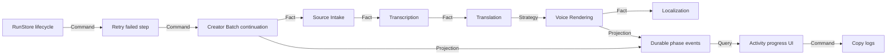

# Live Progress and Voice Recovery Design

Date: 2026-08-03
Status: approved by the operator's standing instruction to implement directly without another review stop

## Observable result

When a creator campaign runs, the operator sees the current video and five separate phases—download, transcription, translation, voice and composition—with exact completed/total work. Edge voice synthesis uses bounded concurrency and recovers transient provider failures automatically. A failed Studio run can retry only its failed step and reuse child checkpoints. Logs have a reliable copy action and selecting text is not destroyed by unnecessary DOM replacement.

## Root-cause evidence

Run `d238451a-582c-432f-a692-1d56bd485b52` processed one 164-second video with 62 Russian segments. Download took about 34 seconds, transcription about 12 seconds, translation about 87 seconds and voice about 649 seconds. The voice receipt committed 52 clips and reported 10 scattered `edge_tts.exceptions.NoAudioReceived` failures. The implementation launched `python -m edge_tts` once per segment, used `maximumActiveSynthesis=1` and made no retry attempt.

Replaying failed segment 3 through the existing CLI succeeded in 6.35 seconds, proving the text and voice were valid. Synthesizing three neighboring segments through the resident `edge_tts` Python package concurrently completed in 1.74 seconds. The computer has an RTX 4070 and the Qwen runtime reports CUDA available, while the campaign launcher currently omits `--qwen-device` and therefore selects CPU.

## State owners and invariants

| Mutable state | Sole owner | Invariant |
| --- | --- | --- |
| run lifecycle, failed-step reset and durable queue admission | Video Graph Studio `RunStore` | one versioned transition and at most one live queue entry per run |
| creator item continuation | Creator Batch receipt | videos remain strictly serial and verified completed items are reused |
| downloaded source | Source Intake receipt and manifest | a successor receives only a committed fingerprinted source fact |
| transcript and translation | Transcription and Translation receipts | ordered media/language coverage is preserved |
| voice clip attempt and result | Voice Rendering receipt | one ordered result per translated segment; completed fingerprinted clips are reusable |
| final derivative | Localization receipt and manifest | composition starts only from complete source, translation and voice facts |
| progress display | browser projection | read-only projection of durable logs and committed run facts |
| clipboard feedback | browser UI | no execution state is modified |

## Use cases and typed relationships

- `Retry failed run` — **Command** from the operator to Studio lifecycle ownership.
- `Read run and logs` — **Query** from the browser to Studio.
- `Creator item phase event` — **Projection** emitted at child-owner boundaries and persisted as a run log.
- `Completed child manifest` — **Fact** passed to the next independent MVP.
- `Voice provider` — **Strategy** selected by campaign policy.
- `Edge bounded concurrency and retry` — **Policy** local to the Voice Rendering owner.
- `Qwen auto device resolution` — **Factory** choice inside the Qwen adapter.

## Directed capability graph

## Hard dependencies and safe substitutes

- Run retry must remain a hard Store/Engine capability because lifecycle versioning, queue idempotency and recovery cannot be faked in the browser.
- Creator items remain strictly serial. Parallel videos are not introduced.
- Voice clip concurrency is provider-specific. Edge may use three independent network requests; Qwen remains single-worker because one resident model owns GPU memory.
- The safe test substitute for Edge is a deterministic adapter that fails transiently before succeeding. Tests never require the external service.
- Progress parsing supports legacy human logs so the existing failed run remains understandable; structured events are the authoritative path for new runs.
- Publication is outside this change. Retrying a failed local campaign does not add an upload route.

## Error handling

- Edge retries only recognized transient transport/no-audio failures, at most three attempts with bounded backoff. Invalid voice, invalid output or probe failures remain terminal.
- Every voice result records attempts and elapsed time. Failure logs identify the segment immediately instead of withholding detail until the final receipt.
- Retrying a failed Studio run resets only failed steps to pending, preserves completed steps and child operation IDs, clears the terminal result, and creates one new durable queue entry.
- The UI shows the failed phase, completed/total units, preserved work and a retry action only for failed runs.

## UI

- Replace the single coarse batch row with an item header and five phase rows.
- Each phase shows status, concise detail, an independent progress bar and elapsed time when available.
- Keep the outer four-node graph as a compact system-check section rather than the primary progress display.
- Add `Copy logs`; copying uses the Clipboard API with a bounded fallback and visible confirmation.
- Avoid rewriting unchanged log/timeline DOM. The log pane explicitly allows text selection.

## Verification

- Red-green unit tests for transient retry, bounded Edge concurrency, ordered checkpoint reuse, Qwen auto-CUDA resolution and structured phase events.
- Store and API tests for failed-run retry, idempotent queue admission and completed-step preservation.
- Node tests for legacy/structured progress projection and copy-safe rendering helpers.
- Browser drill against the existing failed run, followed by a retry that processes only the 10 failed voice clips. Do not start the 75-video catalog.
- Full repository tests and manifest validation before integration.

## Self-review

The design contains no placeholders or unapproved publication behavior. It preserves creator-level serial execution, assigns each mutable state to one owner and keeps UI progress downstream of durable facts. The scope is limited to observability, voice reliability/performance, Qwen device selection and recovery of failed local work.
