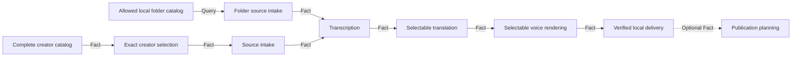

# Local-First Creator Workflow Design

## Observable result

A user can choose either a complete creator account or a local media folder, select translation and voice engines independently, create localized videos in a visible local folder, and optionally add zero or more publication routes. Upload is never required for successful localization.

## Product decisions

- The default creator scope is **all available videos**. A truncated catalog is labelled incomplete and cannot silently enter a campaign.
- Local folders are first-class sources. They do not masquerade as creator accounts and reuse the existing `folder-dub` graph.
- Translation and voice are separate stages and separate policies.
- Translation providers are NLLB (local) and DeepSeek (cloud).
- Voice providers are Edge TTS, Qwen3-TTS preset voices, and Original audio + translated subtitles.
- Local delivery is always enabled. YouTube, Bilibili, Douyin, and TikTok routes are optional downstream plans.
- Qwen3-TTS is offered only for locales supported by the installed local adapter. Readiness is reported before a run starts.
- Processing remains strictly serial and checkpointed. This change does not introduce parallel media execution.

## State owners and invariants

| State | Unique owner | Invariant | Public fact |
| --- | --- | --- | --- |
| Creator pagination | Creator Discovery | `complete=true` only after the source reports no next page; items remain unique and source ordered | Creator Manifest |
| Local folder projection | Studio folder projection | Only allowed roots are readable; media rows are read-only and deterministically ordered | Local Folder Catalog |
| Exact creator subset | Creator Selection | Selected IDs are a source-ordered subset of one fingerprinted Creator Manifest | Selection Manifest |
| Translation artifacts | Translation MVP | One translated document per media and target locale | Translation Manifest |
| Voice clips | Voice Rendering MVP | One verified clip per translated segment using one explicit provider identity | Voice Manifest |
| Localized videos | Localization MVP | Exact media × language coverage with verified fingerprints | Localization Manifest |
| Campaign continuation | Studio / Creator Batch | Completed checkpoints resume with stable operation IDs | Run and Batch receipts |
| Publication plan | Publication MVPs | Optional consumer of verified local derivatives; never a localization prerequisite | Publication Plan |

## Capability DAG

The lowest unproven nodes are honest complete-catalog presentation, local folder presentation, and provider-selectable voice rendering. Publication remains an optional downstream consumer.

## UI flow

1. **Source** — choose Creator account or Local folder. Creator discovery defaults to all videos and exposes incomplete status. Local folder browsing shows exact media files.
2. **Videos** — creator mode supports search and exact selection; folder mode confirms all visible local media.
3. **Translation** — choose languages, then select NLLB or DeepSeek using large visible provider cards.
4. **Voice** — choose Edge TTS, Qwen3-TTS, or Original audio + subtitles. Only compatible voices/locales are enabled.
5. **Output** — choose a local output folder. Optional platform/account routes are collapsed under “Also prepare uploads.”
6. **Review** — show source count, localized output count, optional route count, providers, local path, and blockers.
7. **Activity** — show durable step progress and the final local artifact path.

## Error and recovery rules

- Restored truncated creator runs show an incomplete warning and a one-click “Load all videos” action.
- Creator campaigns reject incomplete catalogs at the API boundary.
- Missing DeepSeek credentials or Qwen runtime/model are visible before start and rejected again by the server.
- Unsupported Qwen locale/provider combinations are rejected before a run is stored.
- Zero publication routes is valid.
- A repeated operation with identical input returns prior evidence; changed provider, source, output, or route policy conflicts under the existing idempotency boundary.

## Evidence

- Focused tests for full/truncated creator admission, folder catalog security, provider contracts, and optional destinations.
- RED/GREEN tests for Edge, Qwen3, and original-audio adapters.
- Browser verification for both creator and local-folder paths at desktop and narrow widths.
- Full repository suite and manifest validation before publication.

## Non-goals

- No claim that Bilibili, Douyin, or TikTok uploads execute.
- No automatic public posting.
- No background parallelization.
- No new free-form graph canvas.
- No Qwen voice cloning in this slice; Qwen preset synthesis is the independently testable provider. Voice cloning remains a separate capability.
