# Studio completion, metadata and publishing design

## Observable result

A creator can run one localization campaign, understand its real performance, preview every completed local video, open its containing folder, inspect output size and reported cloud-token usage, and route a derivative only to a platform account whose connection and execution capability are explicitly verified. The browser can be used in Chinese, English or Russian.

## Design read

This is a dense local creator-production workspace, not a marketing page. Preserve the existing dark technical visual language and seven-stage information architecture. Use low motion, high information density and explicit operational states. The interface remains native HTML, CSS and JavaScript so one-click startup stays portable.

Design dials: `DESIGN_VARIANCE=3`, `MOTION_INTENSITY=2`, `VISUAL_DENSITY=7`. This is a targeted evolution, not a visual overhaul.

## Approaches considered

### Recommended: committed-fact projection

Keep media, translation, voice, localization, credentials and publication as independent owners. Add a read-only Studio result projection over their committed manifests. Add a local range-capable media endpoint for previews. Publishing configuration queries a connection catalog and never treats free-form labels as authenticated accounts.

This preserves recovery, hash verification and honest platform boundaries. It also gives a future mobile client stable JSON contracts.

### Rejected: infer everything from logs

The browser could parse paths, durations and counts from log lines. This is quick but fragile, cannot safely validate media paths, and makes UI copy depend on diagnostic strings.

### Rejected: one large campaign manifest

Creator Batch could absorb output metrics, metadata, credentials and upload state. This would make one process own unrelated mutable state and recreate the monolith the project is intended to replace.

## State owners and invariants

| State | Unique owner | Invariant | Public command or adapter | Public fact or query |
| --- | --- | --- | --- | --- |
| Per-segment voice clips | Voice Rendering | Exact segment ID and time coverage; resumable hashes | Render clips | Voice Manifest and receipt |
| Translation usage | Translation | Usage belongs to the exact provider response that produced an item | Translate item | Per-item usage in Translation receipt |
| Source media metadata | Source Intake | Metadata and thumbnail describe the downloaded media fact | Intake URL | Source Manifest platform metadata |
| Localized videos | Localization | Every file is hash, size, duration and codec verified | Compose derivative | Localization Manifest |
| Campaign continuation | Creator Batch | One item active; completed items resume by fingerprint | Localize creator selection | Creator Batch Manifest and receipt |
| Browser result view | Studio projection | Read-only; never mutates media-owner manifests | Query run results | Bounded result JSON |
| Preview stream | Studio media adapter | Only verified result files under allowed roots; HTTP byte ranges | Read media | Video response |
| Platform secrets | Credential Vault | Secrets encrypted with CurrentUser DPAPI and never returned | Put, rotate, revoke | Redacted connection record |
| Publication intent | Publication | Exact video, metadata, platform, account, credential and visibility fingerprint | Plan publication | Publication Plan |
| Platform upload | Platform-specific publisher | No success without external identity; uncertain outcomes fenced | Execute confirmed plan | Publication receipt |
| UI locale | Browser | One of `zh-CN`, `en-US`, `ru-RU`; persisted locally | Select locale | Rendered copy |

## Use cases and relationships

- `Query`: Studio reads a completed Workflow Run.
- `Fact`: the run points to a verified Creator Batch Manifest.
- `Projection`: Result Projection resolves verified Localization and Translation receipts into bounded rows.
- `Adapter`: Local Media serves only paths present in that projection.
- `Query`: the UI reads redacted platform connection status.
- `Policy`: Publication Readiness permits execution only when platform, visibility and credential state are supported.
- `Command`: the user explicitly creates and confirms a publication plan.
- `Fact`: a platform publisher returns an external platform ID or a fenced failure/unknown state.

## Capability DAG

```mermaid
flowchart LR
    R["Completed Workflow Run"] -->|Fact| P["Result Projection"]
    L["Localization Manifest"] -->|Fact| P
    T["Translation Receipt"] -->|Fact| P
    P -->|Query| U["Completion UI"]
    P -->|Policy| M["Verified Media Preview"]
    S["Source Metadata"] -->|Fact| X["Release Metadata"]
    T -->|Fact| X
    C["Credential Vault"] -->|Query| A["Connection Catalog"]
    A -->|Policy| D["Destination Readiness"]
    X -->|Fact| D
    P -->|Fact| D
    D -->|Command| PP["Publication Plan"]
    PP -->|Command| PE["Confirmed Platform Execution"]
```

## Build order

1. Voice Rendering: raise Edge bounded concurrency from three to the measured six-worker plateau while retaining retry and checkpoint behavior.
2. Translation: persist provider-reported prompt, completion and total token usage without inventing counts for local NLLB.
3. Studio Result Projection and Verified Media Preview: expose output location, per-video facts, total bytes, elapsed time and reported token usage.
4. Completion UI: replace the terminal-only final state with preview, open/download actions and metrics.
5. UI locale: translate static and dynamic workspace copy in Chinese, English and Russian.
6. Source and release metadata: preserve title, description, tags and thumbnail facts, then generate editable per-language publishing metadata.
7. Connection Catalog and publication composition: list redacted accounts, show setup actions, visibility choices and platform capability truth. YouTube private execution remains the first verified execution path. Other platforms cannot be labeled executable until their installed adapter and authenticated platform run are verified.
8. One-click launcher and README: provide a root launcher, workflow diagram, real screenshots and a short recorded browser demonstration.

## Failure behavior

- A missing or stale manifest yields an explicit unavailable result row, never a guessed path.
- Preview rejects traversal, unverified files and unsupported extensions.
- Missing token usage displays `not reported`, never zero.
- A disconnected platform cannot be selected for execution.
- A plan-only platform may save an editable local plan but cannot show an upload-success state.
- Private/public visibility is part of the plan fingerprint. Changing it requires a new confirmation.
- An upload with an uncertain outcome is not retried automatically.

## Scope and decision boundaries

Included now: measured Edge throughput, completion projection and preview, elapsed/size/token facts, three UI locales, credential-aware publication controls, source metadata preservation, one-click startup and documentation media.

Not claimed without live evidence: successful authenticated upload to the user's YouTube, TikTok, Douyin or Bilibili account; public YouTube execution; automatic thumbnail upload where the platform adapter does not expose it; exact token cost when a provider omits usage.

The user has already specified local output must remain valid without publication, requested all three UI languages, requested private/public choice, and previously asked the agent to continue without repeated approval prompts. Those instructions resolve the product choices needed for this design.
