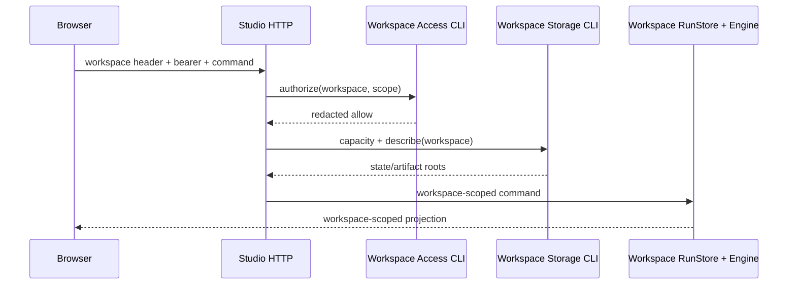

# Route Multiple Local Workspaces

This tutorial composes three independent owners without merging their state: Workspace Access decides who may act, Workspace Storage decides where runtime files belong, and Video Graph Studio owns workflow continuation.

## 1. Provision matching workspace IDs

Create each workspace in both registries. Access roots are folders the creator may select as input; Storage roots are private runtime namespaces.

```powershell
$access = "$env:LOCALAPPDATA\VideoGraphStudio\workspace-access.json"
$storage = "$env:LOCALAPPDATA\VideoGraphStudio\workspace-storage.json"
$storageRoot = "$env:LOCALAPPDATA\VideoGraphStudio\storage"

foreach ($workspace in @("alpha", "beta")) {
  .\apps\workspace-access\run.ps1 init `
    --registry $access --workspace-id $workspace `
    --display-name "Studio $workspace" --allowed-root "$HOME\Videos" --json

  .\apps\workspace-storage\run.ps1 provision `
    --registry $storage --workspace-id $workspace `
    --storage-root $storageRoot --quota-bytes 107374182400 --json
}
```

## 2. Issue one browser credential per workspace

```powershell
.\apps\workspace-access\run.ps1 issue `
  --registry $access --workspace-id alpha --label alpha-browser `
  --scope runs:read --scope runs:write --scope artifacts:read `
  --ttl-hours 24 --json
```

Repeat for `beta`. Keep each plaintext credential with its workspace ID; the registry stores only a digest.

## 3. Start routed Studio

```powershell
.\apps\video-graph-studio\run.ps1 `
  -AccessRegistry $access `
  -StorageRegistry $storage
```

Do not pass `-WorkspaceId`. Open **Access**, enter one workspace ID and its credential, and connect. To switch, clear the session and connect the other pair.

## 4. Understand the request path



The runtime is created only after authorization. Each workspace has its own SQLite file and FIFO queue. A single process-wide execution gate still allows only one workflow/child process to execute at once. FIFO order between different workspace queues is not promised.

## 5. Run the complete isolation drill

```powershell
.\scripts\drills\multi-workspace-studio.ps1
```

The drill provisions two workspaces, starts a hidden loopback server, creates the same operation in both, verifies isolated lists and cross-workspace denial, checkpoints and hashes both SQLite databases, checks secret redaction, stops the process tree and confirms the port closed.

Read [the recorded evidence](../project/evidence/video-graph-studio/multi-workspace-routing-drill.md). This local proof is not a production tenant-isolation or hosted-security claim.
