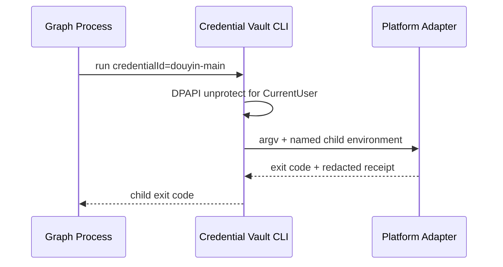

# Local credential custody tutorial

This tutorial keeps platform secrets out of Graph definitions, SQLite, receipts and command arguments. Credential Vault stores the encrypted value; other owners keep only a credential ID.

## 1. Put from an environment variable

```powershell
$vault = "$env:LOCALAPPDATA\VideoGraphStudio\credential-vault.json"
$env:PLATFORM_COOKIE = Get-Content -Raw "$HOME\Downloads\cookies.txt"
& .\apps\credential-vault\run.ps1 put --vault $vault --credential-id douyin-main --provider douyin --label "Main" --secret-env PLATFORM_COOKIE --json
$env:PLATFORM_COOKIE = $null
```

Do not paste the secret after a CLI flag: operating-system process inspection and shell history can expose command arguments.

## 2. Pass a reference through the workflow

Store `douyin-main`, not cookie content, in a publication or discovery request. The eventual platform adapter is launched through Credential Vault and receives the resolved value in its declared target environment.



## 3. Rotate or revoke deliberately

Use `rotate` for changed secret material. Use `revoke` when the reference must never resolve again; revocation deletes ciphertext rather than merely adding a flag. Platform-side logout or token revocation remains a platform-adapter or operator action.

## 4. Verify the local boundary

```powershell
powershell -NoProfile -ExecutionPolicy Bypass -File .\scripts\drills\credential-vault.ps1
```

Success proves a real DPAPI round-trip and child injection on the current machine. Continue with [credential-aware publication](06-credential-aware-publication.md) to prove the provider-bound process composition. Neither drill proves a social platform accepts the credential.
