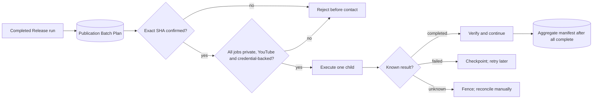

# Execute a verified release batch

This tutorial connects a completed `Folder+Release` or `URL+Release` planning run to the independent Publication Batch Execution owner. Current policy supports credential-backed **private YouTube** plans only.

## Before you start

You need:

- a completed Release run whose Publication Batch Plan contains only private YouTube targets;
- an active YouTube credential in Credential Vault;
- the exact SHA-256 shown by Studio for that batch plan;
- intentional permission to contact the platform.

Planning and execution are separate confirmation surfaces. Creating a Release plan never uploads anything.

## Browser workflow

1. Start Video Graph Studio and choose **Release Execute**.
2. Select the completed Release run. Studio fills the exact committed plan SHA; do not replace it with a different file's hash.
3. Enter the provider-bound credential ID and select the home-confined Credential Vault file.
4. Review the graph. It must contain `execute-publication-batch` followed by `verify-publication-batch-execution`.
5. Create and start the run only when private uploads are intended.
6. Inspect the execution receipt. A complete run has one verified child result for every ordered batch item plus `publication-batch-execution-manifest.json`.



## Resume rules

- Completed children are reused only after their plan, media, metadata, receipt and manifest hashes still match.
- Known failures may retry with the same stable child operation ID.
- `UNKNOWN` means the platform may have accepted the upload. Replay returns `REJECTED_UNKNOWN`; reconcile the provider state before any manual action.
- The coordinator never runs two children at once and never publishes an aggregate manifest for a partial batch.

## Command-line equivalent

```powershell
powershell -ExecutionPolicy Bypass -File .\apps\publication-batch-execution\run.ps1 execute `
  C:\Jobs\publication-batch-plan.json `
  --confirmation <exact-64-character-sha256> `
  --credential-vault "$env:LOCALAPPDATA\VideoGraphStudio\credential-vault.json" `
  --output-dir C:\Jobs\publication-batch-execution `
  --operation-id release-execution-001 `
  --json
```

Exit code `0` means completed or verified duplicate, `2` means a known rejection/failure and `3` means an uncertain result that must not be retried automatically.

